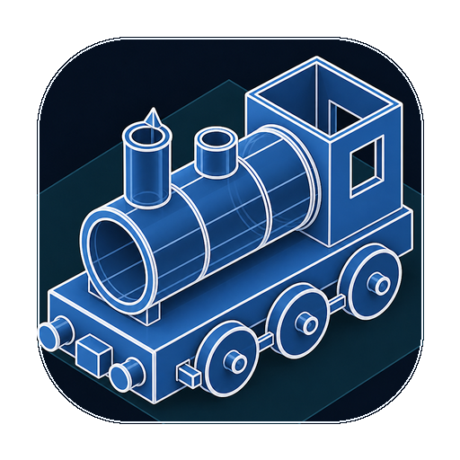

<p align="center">
  
</p>

# SolidExpress

Parametric solid modeler built on **OCCT** geometry, a **Godot 4.7** UI via GDExtension, and **PlaneGCS** for 2D sketch constraints.

The product is AI-first: every selectable entity has a generated markdown **semantic card** (machine sections regenerate; free-text Aliases/Notes are preserved), and the whole document can be exported as markdown context (`File > Export AI Context…` / `SxDocument.export_context()`).

## Prerequisites

**Ubuntu packages:**

```bash
sudo apt-get install -y ninja-build zip \
  libocct-foundation-dev libocct-modeling-data-dev \
  libocct-modeling-algorithms-dev libocct-data-exchange-dev \
  libocct-ocaf-dev libocct-visualization-dev \
  libeigen3-dev libboost-dev
```

**Godot 4.7-stable** (Linux x86_64 binary): download from
[godotengine/godot-builds](https://github.com/godotengine/godot-builds/releases),
place the executable at `tools/godot/godot` (that path is gitignored), and make it executable:

```bash
chmod +x tools/godot/godot
```

CMake 3.22+, a C++20 compiler, and Ninja are required for the superbuild.

## Build, run, test

```bash
make build   # cmake -G Ninja + build (sxkernel, libplanegcs.so, game/bin/libsxcore.so)
make run     # import then launch the Godot project
make test    # Catch2 kernel suite + headless Godot suites
```

`make run` and Godot test targets invoke `make import` automatically. Import runs Godot headless once to bake the `.godot` cache so scripts and the editor resolve correctly.

## Releases

Tagged builds and Linux desktop exports are documented in [docs/release.md](docs/release.md). Quick path:

```bash
make release-linux          # fetch Godot templates + export .tar.gz under dist/releases/
git tag v0.1.0 && git push origin v0.1.0   # triggers GitHub Release CI
```

Useful details:

- Default CMake build type is `RelWithDebInfo`.
- Kernel tests: `build/sxkernel/sxkernel_tests` (also via `make test-kernel`).
- Godot tests (`make test-godot`): includes sketch suites (`run_sketch_*.gd`, `run_sketch_fully_defined_tests.gd`, `run_sketch_expr_dim_tests.gd`, `run_convert_entities_tests.gd`, sweep/loft, UI, workflow, …).

## Architecture

| Tree | Role |
|------|------|
| `sxkernel/` | Static C++20 modeling kernel: `Document`, bodies, undo/redo command stack, `FeatureGraph` parametric timeline, topological naming, sketch entities + PlaneGCS `SolverBackend` seam, tessellation/picking, STEP/IGES/STL interop, `.sxp` zip I/O. No Godot dependency; Catch2 unit tests. |
| `sxcore/` | GDExtension shared library binding the kernel into Godot; output is `game/bin/libsxcore.so`. |
| `game/` | Godot 4.7 project: orbit camera, viewport interaction (select / move / push-pull / sketch), timeline / ops / card / variables panels, headless tests under `game/tests/`. |
| `thirdparty/` | Vendored dependencies (godot-cpp, PlaneGCS + shim, miniz, nlohmann/json, Catch2, extension API dump). |
| `docs/` | Survey + tool picks (`docs/survey/`); plan index (`docs/plan/README.md`), roadmap, landing protocol (chrome/films), implementation plan, and `STATUS.md`. |

PlaneGCS is built as a **shared** library (`libplanegcs.so`) to satisfy LGPL dynamic-link policy; the kernel links it through the solver seam.

## How to…

Short, verified walkthroughs (each ends with the automated test that proves the goal):

- [Place a box and orbit](docs/howto/place-and-orbit.md) — ground placement, selection kept, middle-drag over panels
- [Stack three blocks](docs/howto/stack-three-blocks.md) — place on top faces (total height 150 mm)
- [Extrude an S shape](docs/howto/extrude-s-shape.md) — closed S-channel sketch → solid
- [Cut a horizontal hole](docs/howto/horizontal-hole.md) — rotate + lengthen a cylinder, Subtract through a box
- [Mounting block with through-hole](docs/howto/mounting-block.md) — Box + Apply hole (`O`); click vs keyboard vs SolidWorks

## Keyboard and mouse

Bindings verified in `game/scripts/orbit_camera.gd`, `viewport_interaction.gd`, and `main.gd`.

### Navigation

| Input | Action |
|-------|--------|
| Empty-drag / right-drag / two-finger | Orbit |
| Middle-drag / 3-finger grip | Pan (SX/Fusion default; SW preset orbits) |
| Shift + middle-drag | Orbit (SX/Fusion); pan under SW preset |
| Shift + two-finger | Pan (trackpad) |
| Mouse wheel | Zoom toward cursor |
| Shift / Alt / Shift+Alt + wheel | Pan vertically / yaw / pan horizontally |
| One-finger / two-finger touch | Orbit (emulated) / pan + pinch-zoom |
| Arrow keys / Shift+arrows | Pan / orbit |
| WASD | Fly: W/S in/out along look, A/D strafe (sketch tools reclaim these while sketching) |
| Alt+WASD | Screen-space pan |
| `+` `−` / Page Up/Down | Zoom at view center |
| `F` / Home | Zoom extents (selection, else all) |
| `1` / `2` / `3` / `7` | Front / right / top / isometric (+ fit) |
| `5` | Toggle orthographic / perspective |

### Modeling

| Input | Action |
|-------|--------|
| Click | Select body; click again on the same body to refine to a nearby edge or the hit face |
| Drag selected body | Move on the ground plane (live preview; commits on release) |
| Drag selected face | Push/pull along face normal (planar faces) |
| `Del` / Backspace | Delete selected body |
| `Ctrl+Z` | Undo |
| `Ctrl+Y` or `Ctrl+Shift+Z` | Redo |
| `Ctrl+S` | Save |
| `Ctrl+O` | Open |
| `Shift+W` | Cycle display mode (shaded → shaded+edges → wireframe) |
| `K` | Toggle section-view clipping plane |
| `G` | Toggle world gizmos (origin triad + XY grid) |

### Sketch mode

Active while a sketch session is open (`sketch_mode.active`).

| Input | Action |
|-------|--------|
| `S` | Select tool |
| `L` | Line |
| `R` | Rectangle |
| `C` | Circle |
| `T` | Trim |
| `X` | Toggle construction geometry on selection |
| Right-click / Done / double-click | End line chain (auto-closes when Auto-close is on) |
| `Esc` | Unlock typed length, end open chain, or discard sketch |

## `.sxp` document format

Native documents use the `.sxp` extension: a zip archive written with miniz.

| Entry | Contents |
|-------|----------|
| `manifest.json` | Format id/version, body UUIDs, names, colors, BREP paths, subshape id lists |
| `breps/<uuid>.brep` | Per-body OCCT BREP blob |
| `features.json` | FeatureGraph timeline (feature params, embedded sketches, variables/equations) |
| `datums.json` | Datum planes, axes, and points |
| `instances.json` | Component instance placements (source body + transform) |
| `cards/<uuid>.md` | Per-entity semantic cards |

Older archives without `datums.json` or `instances.json` still load; those sections are optional for backward compatibility.

## How to…

Short, verified walkthroughs (same steps exercised by `game/tests/run_howto_tests.gd`):

- [Place a box and orbit](docs/howto/place-and-orbit.md)
- [Stack three blocks](docs/howto/stack-three-blocks.md)
- [Extrude an S-shaped profile](docs/howto/extrude-s-shape.md)
- [Cut a horizontal hole](docs/howto/horizontal-hole.md)
- [Mounting block with through-hole](docs/howto/mounting-block.md)

## License policy

**Never GPL or AGPL.** LGPL is allowed only with **dynamic linking**. Record every dependency in [`THIRD_PARTY.md`](THIRD_PARTY.md) before first use.

**Open CASCADE Technology (OCCT)** is licensed under **LGPL-2.1 with the OCCT exception**. SolidExpress links OCCT dynamically from system packages; that license notice must remain prominent in documentation and About surfaces. PlaneGCS (LGPL-2.1-or-later) follows the same dynamic-link rule.
