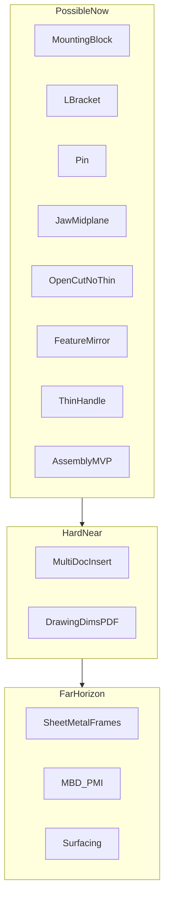

# SolidExpress Roadmap

Single source for **what’s next**. Checkbox ledger lives in [STATUS.md](STATUS.md); long architecture catalog in [implementation-plan.md](implementation-plan.md); competitor universe in [docs/survey/](../survey/README.md).

| Doc | Role |
|---|---|
| **This file** | Priority order, SW-video feasibility, website sync |
| [STATUS.md](STATUS.md) | Done / not-done checkboxes only |
| [implementation-plan.md](implementation-plan.md) | P0–P11 architecture bible — not weekly priority |
| [docs/survey/](../survey/README.md) | Feature universe + workflow studies |
| Cursor plans | Ephemeral; superseded items listed below |

---

## 1. North star

SolidWorks-shaped parametric MCAD: history-based solids, sketch constraints, feature timeline, assemblies with mates — **Linux-first**, OCCT B-rep, PlaneGCS sketcher, Godot shell. Near-term script ladder: Nick Ler [SOLIDWORKS Beginner’s Guide](https://youtube.com/playlist?list=PLiKqXuECiKNLzF6aDC3z-H1BZ94ITZIQk) (mounting block → L-bracket → needle-nose pliers parts + motion), as mapped in [workflow-study-mounting-block.md](../survey/workflow-study-mounting-block.md) and [workflow-study-needle-nose-pliers.md](../survey/workflow-study-needle-nose-pliers.md).

Standing choices: FeatureGraph as source of truth ([ADR-001](decisions.md)); UUID topology refs ([ADR-002](decisions.md)); Path merge instead of free 3D sketch; mate connectors + DOF joints as the assembly model.

---

## 2. Ships today

Synced from STATUS (2026-07-29). Not a full feature dump — enough to keep marketing honest:

- **Sketch** — PlaneGCS entities/relations, Smart Dim, expressions, Fully Define / Analyze, Convert/Mirror/Pattern, Power Trim, Path (multi-sketch), loft guide rails
- **Features** — extrude (blind / through_all / midplane) + thin wall + flip; **open-profile cut + Flip Side**; Selected Contours (disjoint **and shared-edge**); revolve / sweep / loft; boolean / fillet / chamfer / shell / offset / draft / hole / Hole Wizard / helix / thread; **feature-level mirror** + body mirror; patterns; variables / configs / timeline
- **Assemblies** — same-doc instances; concentric + plane_coincident (**Flip Mate Alignment**) + fixed mates; revolute DOF instance drag (`run_pliers_motion_tests`); **mate/instance undo** (`AssemblySnapshotCommand`); revolute **joint limits** (`angle_min` / `angle_max`)
- **Docs / interop** — drawings MVP (HLR → SVG); STEP / IGES / STL; measure; materials + mass
- **Shell** — binaries for Linux / Windows / macOS; voice ask bridge; ViewCube, section view, display modes

**Explicit not-yet (do not market as shipped):** multi-document component insert; drawing dimensions / PDF / DXF; free 3D sketch; sheet metal / frames / surfacing; full joint library / explode / interference / BOM.

---

## 3. SW video feasibility

Inspiration: Nick Ler beginner series + survey master list. Verdicts are against **SolidExpress today**, not against “ever.”

### Possible now

| Demo / workflow | Notes |
|---|---|
| 1 Mounting block (100×60×30 + Ø20 through) | Place hole or sketch→cut; Hole Wizard optional |
| 2 L-bracket + inner fillet | `workflow_bracket`; formal SW click study still pending |
| 3 Pliers pin | Circle → extrude |
| 4 Jaw body (midplane extrude) | `through_all` / `midplane`; Selected Contours for disjoint **and** shared-edge (circle+nose) sketches |
| 5 Jaw open cut + Flip Side | Open-profile cut (half-plane, no thin) + Flip chrome |
| 6 Symmetry finish (Mirror Features + Fillet) | Feature-level mirror shipped |
| 7 Handle (open sketch → Thin Feature) | Thin extrude on open profile shipped |
| 8 Assembly + drag motion | Same-doc MVP + revolute drag + Flip Mate Alignment |

### Hard — near-term engineering (active ladder)

| Gap | Why it matters |
|---|---|
| **Multi-doc** component insert | SW-style part files → assembly; same-doc still demos |
| Drawing **dims → PDF/DXF** | Shop prints on top of SVG MVP |

### Hard — mid horizon

Full joint library, mechanical mates, interference, explode, BOM; production drawings / GD&T; richer STEP AP242 (structure/colors); Architecture Tracks B (modularize) / C (CI).

### Impossible or far with current stack

| Item | Why |
|---|---|
| Parasolid-grade topological naming | OCCT + UUID refs are “good enough,” not SW TNI |
| Full SolidWorks ecosystem / Windows-only tooling parity | Different product bet |
| Sheet metal, frames, weldments, surfacing as **near-term** | Deferred to P8 until solid/assembly ladder closes |
| CAM / FEA / PDM-lite / MBD semantic PMI as near-term | P9–P11 |
| Free **3D sketch** | Explicitly out of scope; use Path merge |

---

## 4. Active program — SW Beginner Demo Ladder

**This ladder owns priority.** Close remaining hard items in order:

1. **Assembly depth** — multi-doc `.sxp` insert (mate/instance undo + joint limits ship)
2. **Drawings that ship** — dimensions on views, then PDF/DXF
3. **Interchange leftovers** — AP242 structure/colors, 3MF/glTF, DXF→sketch (only what’s still missing)

**Demoted until the ladder closes:** sheet metal, surfacing, frames, MBD. Architecture Track B/C and friendliness phases 22–27 only in parallel when they do not fight ladder file ownership.

Exit criteria: Nick Ler pliers parts + assembly motion without workarounds that diverge from the SW feature tree (thin/open/mirror/open-cut/undo/limits/shared-edge contours already on the path; multi-doc for training-series UX).

---

## 5. Horizon map

Maps to [implementation-plan.md](implementation-plan.md) without renumbering STATUS or P-phases.

| Horizon | Maps to | Themes |
|---|---|---|
| **Near** | Residual P4 / P5 / P6 | Multi-doc insert; drawing dims/PDF; interop leftovers |
| **Mid** | P8–P9 | Sheet metal / frames; PMI / MBD; motion studies / rendering depth |
| **Far** | P10–P11 | AI IntentConstraint / solver swap; plugins; CAM/FEA spikes; PDM-lite |

Friendliness (phases 22–27) and voice unmatched-phrase AI are polish tracks — schedule around the ladder, not ahead of it.

---

## 6. Superseded Cursor plans

Absorbed into this file + STATUS. Do not reopen as competing priority owners.

| Plan theme | Landed | Residual |
|---|---|---|
| Next 3 majors (pliers path) | Thin/flip, feature mirror, Hole Wizard, Arch Track A, sketch audit | Open-profile cut without thin |
| SW Demo Ladder | Ordering + site rewrite intent | Site cards (this pass); open-cut / assembly polish |
| Pliers feature gaps | P0 motion, midplane/through_all, golden tests, undo, joint limits, open-cut | Multi-doc insert |
| SW sketch parity + SW-class upgrades | Visual sketcher, Path, relations, exprs, Fully Define, guides | Do **not** reopen full overhaul |
| CAD UX parity (13–20) | Familiarity + mates/drawings MVP/configs | Depth items → near horizon |
| Peer-parity deep UX | Timeline / glyphs / instance drag | — |
| Precision UX (Phase 21) | Pickable hole/pattern/mirror; ° UI; helix/thread | — |
| Visual UX survey | Hover / gizmos / RMB / HUD patterns doc | Friendliness 22–27 leftovers |
| Architecture Tracks A/B/C | Track A done | B modularize / C CI — demoted vs ladder |
| Friendliness 21–28 | 21 + 28 (voice) done | 22–27 when not blocking ladder |
| CAD feature survey | `docs/survey/` deliverables | Optional future SX column on matrix |

---

## 7. Website sync checklist

Canonical public story: [solidexpress.github.io](https://github.com/solidexpress/solidexpress.github.io).

**Near-term cards (ordered):**

1. Assembly depth — multi-doc component insert (mate undo + joint limits + Flip Mate Alignment already ship)
2. Drawings that ship — dimensions on views, PDF/DXF on SVG MVP
3. Richer interchange — AP242 structure/colors, 3MF/glTF, DXF→sketch

**Later (one card):** automation / plugins; MBD / PMI; sheet metal & frames & surfacing — after the solid/assembly ladder.

**Remove / never claim as future:** Ready-to-run builds (binaries already on Download); near-term sheet metal as a primary card.

**Also:** `build.html` must point to homepage downloads, not “packages on the roadmap.”

Optional follow-up: add a SolidExpress column (F/P/–) to [feature-matrix.md](../survey/feature-matrix.md).

---

## Related

- [STATUS.md](STATUS.md)
- [implementation-plan.md](implementation-plan.md)
- [decisions.md](decisions.md)
- [workflow-study-needle-nose-pliers.md](../survey/workflow-study-needle-nose-pliers.md)
- [workflow-study-mounting-block.md](../survey/workflow-study-mounting-block.md)
- [binary-distributions.md](../binary-distributions.md)
- [release.md](../release.md) — demo movie publish
