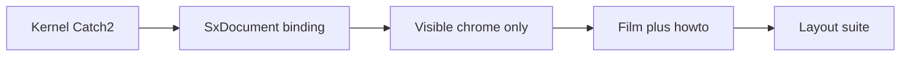

# Feature landing protocol

Merge checklist, chrome budget, and **film slate for Waves 0–4**. Product sequence and tool picks stay in [roadmap.md](roadmap.md) and [../survey/tool-approaches.md](../survey/tool-approaches.md). This file is how each row becomes visible UI plus a movie that illustrates the benefit.

A fresh agent should read this instead of relying on chat. If you invent later work, add a row here (film + chrome) and in the roadmap — see [README.md](README.md).

Existing machinery: left-rail swap, auto-hide docks, `SelectionStrip`, on-canvas sketch chips, schema-driven [property_panel.gd](../../game/scripts/property_panel.gd), [run_layout_tests.gd](../../game/tests/run_layout_tests.gd), click-only [FilmUI](../../game/tests/lib/film_ui.gd), [ui_movie_manifest.json](../../game/tests/ui_movie_manifest.json), `make movies`, [.cursor/rules/gdscript-click-driven-tests.mdc](../../.cursor/rules/gdscript-click-driven-tests.mdc).

Execute **Wave 0 first**. Do not start a later wave until its dependencies and the previous wave’s exit films exist.

---

## L1–L5 (every feature, every wave)

A feature is not merged until all five layers exist.

**L1 — Kernel.** New `FeatureType` / mate / constraint / sheet / drawing object lives in `sxkernel` with a Catch2 case that asserts a *user-visible benefit* (volume, DOF, overlap mm³, connector count, flat length, dim value), not only “function returned true.” Cards + stable UUIDs on every new selectable. Graph-owned: no one-shot commands that vanish on regen.

**L2 — Binding.** One `SxDocument` / `SxSketch` method. Params are JSON so PropertyPanel `SCHEMAS` grows by a row, not a new dock.

**L3 — Chrome.** The verb is reachable from the current selection. If it is not clickable, the film fails — no private-API helper. See chrome budget below.

**L4 — Movie.** `game/tests/films/film_<id>.gd`: toast → beats → FilmUI clicks only → camera showcase → caption that states the benefit. Register in the manifest. Matching `docs/howto/<id>.md`. Headless smoke via film UI tests or [run_film_manifest_smoke.gd](../../game/tests/run_film_manifest_smoke.gd). `scripts/sx-movies one <id>` when a display is available.

**L5 — Hygiene.** [run_layout_tests.gd](../../game/tests/run_layout_tests.gd) stays green. F1 overlay updated if a key was added. [STATUS.md](STATUS.md) checkbox + roadmap row marked.

Kernel-only PRs are allowed only for a seam (e.g. connector data model) when the film lands in the next PR on the same branch.

### Movie template

Each film answers: *what could I not do yesterday, and why does that matter?* Follow [film_extrude_s_shape.gd](../../game/tests/films/film_extrude_s_shape.gd):

1. `movie_toast` — one sentence of intent
2. 3–6 `beat`s that name the user action
3. FilmUI clicks only
4. Geometric check as narrative *and* a hard fail in the companion test
5. `camera.showcase_smooth`

Headless CI runs the film script. `make movies` is the human artifact, not the gate.

**Website demos.** solid.express may only show a play button for a film whose
`.webm` is on the Pages-repo Release `demo-movies` *and* whose id is in
`website/assets/published-demos.json`. Featured homepage cards come from
`website/assets/demo-catalog.json` ∩ that set — never hardcoded Wave film ids.
**Never commit video files** to the app repo or the Pages git repo; WebMs exist
only as that Release’s assets. `make check-website-demos` (CI) HEADs every
published WebM. Refresh with `make movies && make publish-demo-movies`, then
sync the site. Do not advertise unshipped films (sheet metal, explode, …) just
because a `film_*.gd` exists.

### Code quality

- Features: JSON + `FeatureGraph`. Sketch: `SolverBackend`. Assemblies: connectors — do not add gear/width onto the face-pair struct (Wave 4.10).
- Hotspots: `viewport_interaction.gd`, `sketch_mode.gd` — one workstream each; new behavior in helper scripts those files call.
- No GPL. Own DXF. CAM/FEA only LGPL-dynamic or BSD. `THIRD_PARTY.md` before any new dep. CalculiX / Gmsh / libdxfrw banned.
- OCCT failure → timeline `!`, not a crash.
- Film/UI = visible controls only.

---

## Chrome budget

| Surface | Allowed to grow | Forbidden |
|---|---|---|
| Viewport handles / live mm badge | Primary way to *do* the tool | A second gizmo family beside TriBall |
| `SelectionStrip` | 1–2 selection-aware icon verbs | Spinboxes, wizard dialogs |
| RMB / S-key marking menu (0.9) | Overflow for the current pick | A ribbon of the whole wave |
| Left rail | Mode swap (create / modify / sketch / Draw / Sheet). On-canvas chips for variants | Always-on extra palettes |
| OpsPanel | `MAX_HEIGHT` 240; prefer PropertyPanel | Another spinbox row per feature |
| PropertyPanel + timeline | Params after the feature exists | Hidden-only editors |
| New docks | Wave 0: none. Later: **at most one new mode rail** with auto-hide | Extra columns, workbenches |

**Visibility**

- Empty document: palette + ViewHud/ViewCube only.
- On select: strip + left Modify + card. Primitives hide.
- Drag: number travels with the handle.
- Solver state is on the geometry (gray weak dims, yellow inference, blue/black/red entities).
- Connector glyphs on hover, not frames on every body.
- **Draw (W1):** sheet is the viewport; model chrome hides; dims on the sheet.
- **Sheet metal (W2):** folded/flat is a **split viewport**, not a second document. Bend table is a thin strip on the flat side.
- **Frames (W2):** profile chip after a 3D-sketch path.
- **Surfaces (W2):** same strip verbs as solids; zebra is a ViewHud toggle (like K).
- **AI (W3):** hold-V + card highlight; What’s Wrong is a timeline-row popover.
- **W4 modes** (Cam / Sim / Form): one rail entry that *replaces* Modify, never stacks.

Until 0.9 lands, new verbs go on the strip or RMB — never a new dock.

---

## Wave 0 — Daily-driver close (execute first)

Depends on: current STATUS. Picks: A2, A3, A4, A6, A7, A8, A15, A17.

| # | Feature | Chrome | Files | Film |
|---|---|---|---|---|
| 0.1 | Mate connectors + fastened | Hover glyphs; AssemblyPanel lists connectors; two-click face flow creates connectors | `sx/mates.hpp`, `connector_overlay.gd`, `assembly_panel.gd` | `fasten_bolt` — one mate, bolt sits in the hole |
| 0.2 | Extrude end conditions | PropertyPanel enum + on-canvas chip | `sx/features.hpp` extrude params | `extrude_through_all` — plate cut through, thickness unchanged |
| 0.3 | Direct edits as history | Existing push/pull; commit writes `DirectEdit` | `FeatureType::DirectEdit` | `direct_edit_import` — pull imported face; timeline + reload keep it |
| 0.4 | TriBall-class gizmo | One viewport tool; primary handle | `triball_gizmo.gd` | `triball_hole_circle` — rotate-copy hole into a bolt circle |
| 0.5 | Sketch constraint completeness | Glyphs; per-entity blue/black/red; popover not dock | `sx/sketch.hpp`, `sketch_mode.gd` | `sketch_mounting_plate` — concentric + DOF 0 |
| 0.6 | Weak dims + Relax | Gray weak dims; drag drops conflicts | Weak flag on constraints | (same film) weak dim yields, strong hold |
| 0.7 | Hole on sketch points + standards | Strip Hole + size chip | Hole params + `thread_standards.hpp` | `hole_wizard_m6` — 4× M6; mass = steel × volume |
| 0.8 | Fillet tool feel | Live preview + chain hover | Fillet preview overlay | `fillet_chain_pocket` — chain a pocket, one commit |
| 0.9 | Marking menu + pick list | Hold-RMB / S; overlapping-pick popup | `marking_menu.gd` | `marking_menu_pick` — popup names both faces |
| 0.10 | DXF in + 3MF/glTF out | File menu; DXF drop into sketch | `sx/dxf.hpp` (no libdxfrw) | `dxf_trace_extrude` — DXF → extrude |
| 0.11 | Import heal + report card | Card on Import feature | Heal on ImportStep/IGES | `heal_and_clash` — named heal report |
| 0.12 | Interference check | Strip verb on two-body select | `sx/measure.hpp` overlap | (same film) overlap mm³ |

**Exit:** [run_workflow_tests.gd](../../game/tests/run_workflow_tests.gd) plus films above. No workaround for through-all, hole pattern, or fastened bolt.

| Slice | Owns | Avoids |
|---|---|---|
| A Connectors | mates, overlay, AssemblyPanel, `fasten_bolt` | New kinds on the face-pair struct |
| B Extrude + holes | extrude/hole params, PropertyPanel, `extrude_through_all`, `hole_wizard_m6` | OpsPanel spinboxes |
| C DirectEdit + TriBall | `DirectEdit`, `triball_gizmo.gd`, `direct_edit_import`, `triball_hole_circle` | Gizmo math inside `viewport_interaction.gd` |
| D Sketch UX | constraints, weak/Relax, DOF colors, `sketch_mounting_plate` | Constraint dock |
| E Fillet | preview + chain, `fillet_chain_pocket` | Blocking OCCT errors |
| F Marking | `marking_menu.gd`, `marking_menu_pick` | Ribbon |
| G Interop | DXF, 3MF/glTF, heal, clash films | libdxfrw |

Order: A and B first; C/D/E in parallel; F after strip verbs; G after B.

**Migration:** load old Fixed / coincident / parallel / concentric as two implicit connectors + one DOF joint. Two-click face flow still creates connectors.

---

## Wave 1 — Joints that move, drawings that dimension

Depends on: 0.1, 0.2, 0.12. Picks: A8, A9, A13, A14, A17.

| # | Feature | Chrome | Files | Film |
|---|---|---|---|---|
| 1.1 | Joint set | Drag free DOF; limit as live mm/deg | Revolute, slider, cylindrical, planar, ball, pin-slot | `crank_slider` — analytic crank-slider positions |
| 1.2 | Snap-to-mate on drop | Magnetic preview over a connector | Joint create on release | `snap_bolt_drop` — drop snaps fastened |
| 1.3 | Exploded views | ViewHud explode; tweak along connector Z | Explode state in `.sxp` | `explode_gearbox` — separate + restore |
| 1.4 | Assembly patterns + mirror | Pattern chip on a jointed instance | Pattern follows seed joint | `bolt_circle_pattern` — 8 bolts, one joint |
| 1.5 | In-context v1 | “Update Context” on the consumer row — never silent | Named context snapshot | `context_update` — neighbor grows, consumer waits |
| 1.6 | Drawing sheet UI | **Draw mode rail.** Sheet is the viewport | Drawing document: sheets, section/detail | `drawing_section` — hatch through a hole |
| 1.7 | Associative dims + annotations | Click edges on a view; dim on the sheet | Dims by naming UUIDs | `drawing_follows_model` — extrude edit updates dim |
| 1.8 | BOM + balloons | Auto-balloon; BOM is a sheet table | Instance quantities | `drawing_bom` — balloons match counts |
| 1.9 | DXF + PDF export | File menu only | Own DXF + vector PDF | (same film) golden entity counts |
| 1.10 | Projected sketch geometry | Convert chip, associative | Naming-stable projections | `convert_survives_edit` — source resize updates edge |
| 1.11 | 3D sketch v1 | Sketch rail 3D toggle | Lines/splines/points on faces/axes | `sweep_3d_polyline` — circle along 3 non-planar points |
| 1.12 | Rib + thicken + wrap | Strip verbs | New feature types | `rib_and_wrap` — rib joins two faces |

**Exit films:** `crank_slider` + `drawing_follows_model` + `drawing_bom` on a 12-component gearbox and a 2-sheet drawing that survives a parameter edit.

| Slice | Owns | Avoids |
|---|---|---|
| H Joints | joint types, snap, explode, patterns, four films | Face-pair mate growth |
| I Contexts | snapshot + Update, `context_update` | Silent live refs |
| J Drawings | `drawing_sheet.gd`, three drawing films | SVG export as the UI |
| K 3D sketch | 3D toggle, associative convert | 3D sketch as a second app |
| L Rib/wrap | feature types + strip, `rib_and_wrap` | OpsPanel rows |

Chrome delta: Draw is the first new mode rail. Model docks auto-hide. No drawing-properties column.

---

## Wave 2 — Sheet metal, frames, surfaces

Depends on: 1.6–1.9, 1.11, Wave 0 materials. Picks: A10, A6, Plasticity feel, SW flange/weldment coverage.

| # | Feature | Chrome | Files | Film |
|---|---|---|---|---|
| 2.1 | Sheet metal core | **Sheet mode rail.** Flange pull + K-factor badge | Flange/hem/jog/relief/bend table | `flange_box_flat` — flat length = bend-allowance |
| 2.2 | Simultaneous folded / flat | Split viewport + thin bend-table strip | Associative flat | `flat_edits_folded` — flat dim updates folded flange |
| 2.3 | Convert solid → sheet metal | Strip verb on thin solid / import | Thickness + rips | `convert_thin_box` — imported thin box unfolds |
| 2.4 | Flat DXF + drawing view | View type Flat; File → DXF | Bend-line layer | `flat_on_drawing` — bend lines + direction |
| 2.5 | Frames / structural members | Profile chip after 3D-sketch path | ISO/ANSI subset, miter, cut list | `frame_cutlist` — 4 members, correct lengths |
| 2.6 | Cosmetic welds + symbols | Bead on edge; symbol on drawing | Cosmetic bead | `weld_on_sheet` — symbol on the sheet |
| 2.7 | Surface toolset v1 | Same strip: Trim, Knit, Thicken, Fill | Surface features + knit-to-solid | `knit_to_box` — 6 planes → solid |
| 2.8 | Continuity analysis | ViewHud toggle | Zebra + curvature shaders | `zebra_cylinder` — zebra; G1 across a knit |
| 2.9 | Replace face | Strip: solid face + surface | Recorded `ReplaceFace` | `replace_face` — lofted top, solid valid |

**Exit films:** `flange_box_flat` + `flat_edits_folded` + `frame_cutlist` + `flat_on_drawing`.

**Not in this wave** (parked in Wave 4 / deferred): aerospace joggles, Class-A, SubD (4.5), composites, mold wizard (4.8).

| Slice | Owns | Avoids |
|---|---|---|
| M Sheet metal | `sheet_metal_view.gd`, 2.1–2.4 films | Second document for the flat |
| N Frames + welds | profile library, cut list, `frame_cutlist`, `weld_on_sheet` | Weldment workbench |
| O Surfaces | surface types, zebra, three films | Class-A control-point UI |

Chrome delta: Sheet is the second (last planned pre-v1) mode rail. Folded/flat splits the same viewport.

---

## Wave 3 — AI-first surface and user features

Depends on: Wave 0 cards + 0.5/0.6/0.7, Wave 1 joints. Picks: A11, A12, A16, A3, implementation-plan P10.

| # | Feature | Chrome | Files | Film |
|---|---|---|---|---|
| 3.1 | Selection query language | Query in card / hold-V; hits highlight | `type=` `created-by=` `adjacent-to=` | `query_hole_walls` — lights hole walls |
| 3.2 | Card digests | One auto sentence on the card | Digest from adjacency + params | `card_digest` — names feature + placement |
| 3.3 | User features | Insert → User Feature; PropertyPanel params | Language or JSON+expressions → graph. Rewrite 2–3 natives | `user_csink` — custom C-sink regenerates |
| 3.4 | Intent → constraints | Hold-V + card UUIDs | Intent layer; PlaneGCS stays numeric | `intent_flush` — fastened offset 0 |
| 3.5 | What’s Wrong | Timeline `!` popover + repair candidates | Failed-feature rematch | `whats_wrong_fillet` — offers the rematch |
| 3.6 | Auto-dimension | One sketch-rail chip | Promote weak/inferred to DOF 0 | `auto_define_plate` — one click, DOF 0 |
| 3.7 | iLogic-style rules | Rules fold on variables panel; CSV | `if width > 100 then suppress rib` | `rules_three_configs` — 3 volumes |
| 3.8 | Headless CLI | No UI | JSON-RPC / CLI open-edit-export | `cli_bracket_step` — validation, not a film |
| 3.9 | Propose-on-select | “parallel?” chip on selection | Inferred relations, user promotes | `propose_parallel` — one-click parallel |

**Exit film:** `nl_four_holes` — mocked LLM: “four M6 clearance holes near the corners of the top face, symmetric.”

| Slice | Owns | Avoids |
|---|---|---|
| P Queries + What’s Wrong | query, digest, repair popover | Chat with no UUID ground truth |
| Q User features + CLI | feature language, CLI | C++-only features forever |
| R Intent + auto-dim | intent, auto-define, propose, `nl_four_holes` | Replacing PlaneGCS |
| S Rules | Rules fold, CSV, `rules_three_configs` | Excel-only as the only driver |

Chrome delta: no new rail.

---

## Wave 4 — Specialized tracks

Spike → L1–L5 → film. Do not start until the dependency is green. One rail that *replaces* Modify.

| # | Track | Dep | Chrome | Film | Notes |
|---|---|---|---|---|---|
| 4.1 | Configurations v2 | 3.7 | Table in existing config switcher | `config_drawing` | Config-aware BOM/drawings |
| 4.2 | Advanced fillets (setback, C2) | 0.8 | Same fillet preview + chips | `fillet_c2` | OCCT risk |
| 4.3 | 2.5-axis CAM | W1 drawings | **Cam rail** | `cam_pocket` | opencamlib LGPL; our posts |
| 4.4 | Linear static FEA | W0 materials | **Sim rail**; load glyphs | `fea_bracket` | MFEM/BSD; no CalculiX/Gmsh |
| 4.5 | SubD → B-rep | W2 surfaces | **Form rail** | `subd_to_solid` | OpenSubdiv; spike first |
| 4.6 | PDM-lite | 3.8 | File → History | `branch_merge_sxp` | Card-aware diff |
| 4.7 | Routing (tube/pipe) | 1.11 | 3D-sketch + bend-table chip | `route_tube` | No plant specs until asked |
| 4.8 | Mold basics | W2 | Strip: parting / core-cavity | `core_cavity` | Not Mold Wizard |
| 4.9 | Scan / mesh hybrid | 0.11 | Snap/measure/boolean vs mesh | `mesh_boolean` | Full convergent later |
| 4.10 | Mechanical joints | 1.1 | Same connector UI | `gear_mate` | On connectors only |
| 4.11 | MBD / PMI | 1.7 | 3D dims on faces | `pmi_survives_regen` | AP242 after 2D dims trusted |
| 4.12 | Standard-parts catalog | 0.1, 1.2 | Palette catalog page | `catalog_fastener` | In base, not a paid tier |
| 4.13 | ECAD board-in-enclosure | W1 | IDX/IDF import | `board_in_box` | Not a schematic editor |

## Wave 5 — Print-first

Depends on: Wave 0.10 3MF, Form rail. Survey: [print-first.md](../survey/print-first.md).

| # | Feature | Chrome | Film |
|---|---|---|---|
| 5.1 | Wall thickness digest | Form strip **Analyze**; marking **Print check** | `print_thin_wall` |
| 5.2 | Overhang + 24-pose orient | Form strip **Orient** | `print_overhang_orient` |
| 5.3 | 3MF metadata + `print.json` | File → Export 3MF (existing) | asserted in Catch2 |

Chrome delta: Form rail already exists. No ViewHud button. No new dock.

---

## Wave 6 — print a tool this afternoon

Depends on: Wave 5 films green (`print_thin_wall`, `print_overhang_orient` — **currently red**, see STATUS Wave 6.0), Wave 0.10 3MF, 4.12 catalog. Picks: [next-roadmap.md](../survey/next-roadmap.md) W6.1–W6.6, [print-first.md](../survey/print-first.md) P1–P6, A1, A12, A17. Priority owner: [ROADMAP.md §4](ROADMAP.md).

**Acceptance bar:** the 2026-08-14 hands-on critique of the published **0.0.4 Linux binary** (shop-tools-construction-basis rubric). What worked there stays worked (Analyze digest, 3MF `unit="millimeter"` + `sx:bed`/`sx:layer`/`sx:min_wall` metadata). What failed is this wave: digits typed into a focused box-H field were eaten by view keys 1/2/3/7; the post-place panel showed Radius/Spacing/Count instead of W/H/D; Form hid the palette with no way back to create; Variables/Config were empty of print params; Thread and Hole Wizard were unreachable in the menus we used; export was digest-only with no paint and no slicer hand-off. Rubric to score against: fastener-sized opening, named clearance, AF family 10/12/14, cut survives thickness (through-all / Up To Surface), head-shaft fillet, modeled thread, nozzle-multiple walls, hex as a real AF polygon.

**6.0 gate:** do not start 6.2+ while `run_workflow_tests`, `run_ui_tests`, or `run_print_tests` are red (STATUS "Verified baseline audit") — and 6.1 construction chrome below is part of that gate (green before 6.2+). Wave 0's exit suite is the floor this wave stands on. **6.0a–e belong to the stabilization agent — do not double-fix or touch its files.**

| # | Feature | Chrome | Files | Film / gate |
|---|---|---|---|---|
| 6.1 | Construction chrome (from the live 0.0.4 test) | Focused numeric fields consume digits — view keys 1/2/3/7 never fire while a spinbox/line-edit has focus; box place strip **and** post-place property panel show W/H/D (not Radius/Spacing/Count); Form keeps a one-click way back to create without losing the Analyze/Orient strip (palette may hide); Selection/Timeline/Variables/Assembly/context bars never stack undismissably | `viewport_interaction.gd`, `ops_panel.gd` / `property_panel.gd` SCHEMAS, `print_strip.gd`, layout suite | extend `run_place_tests` / `run_property_tests` — type H=1.2 on a box and it sticks |
| 6.2 | Clearance language | New documents seed `VariableTable` builtins `clearance=0.3`, `hole_compensation=0.2`, `layer=0.2`, `nozzle=0.4`, `jaw_af=10` (mm) — editable in the existing Variables panel, not a dock. Sketch dims accept `=jaw_af+clearance` and live-regenerate (needs the 6.0b expr-dim fix). Hole Wizard / hole Ø = nominal + `hole_compensation`; hex and slot openings = `jaw_af+clearance` (or explicit AF). Configs named 10 / 12 / 14 switch `jaw_af` only — one model, no rebuild | `sx/variables.hpp` seeded builtins, hole/hex/slot params, `variables_panel.gd` | `clearance_ladder` — change `clearance` 0.3→0.5 and every consumed opening updates; 10/12/14 configs spin one model |
| 6.3 | See the print | Form strip grows **Thickness** / **Overhang** paint toggles (zebra shader path); bed ghost (default 220×220) in Form only; digest stays. Threshold from `PrintSetup` `min_wall` (already 1.2 in the 0.0.4 3MF metadata). Must succeed on a 1.2 mm plate — which needs 6.1 so 1.2 can be typed at all | `print_strip.gd`, viewport shader, per-face data from `sx/print.hpp` | `see_the_print` — 1.2 mm wall and a 60° hang paint; the part sits on the ghost bed |
| 6.4 | Open in slicer | File → **Open in Slicer** with a user-registered Prusa / Orca / Bambu executable; one body per file when handing off; File → Export 3MF unchanged (mm + `sx:bed` already verified on 0.0.4) | export split + registered-app setting; no GPL slicer engine | `open_in_slicer` — headless asserts per-body millimeter 3MF + the registered command line |
| 6.5 | Tool catalog | Palette catalog page (4.12) grows mechanic tools: open-end, hex socket, driver bit, nozzle sizes; AF from `jaw_af`. Not a full Toolbox | `sx/catalog.hpp` + palette page | `catalog_hex_driver` — drop a hex-driver blank; opening tracks `jaw_af` |
| 6.6 | Build the wrench | The construction moves the videos actually won on: jaw/through cuts default to **through-all / Up To Surface** (Blind is the amateur trap); modeled **Thread** reachable in chrome (Insert or Modify → Thread; in Form, Modeled is the default and cosmetic-only is a checkbox — STATUS claims thread, the 0.0.4 menus did not show it); sketch polygon gets an **across-flats** (`jaw_af`) mode — no Fusion `size/2` radius workaround; **Hole Wizard** reachable from the place/context chrome we actually used, not only a buried ops path | thread/hole chrome, polygon AF mode, extrude end-condition defaults | `print_a_wrench` — the critique replay: a stranger builds an open-end or hex wrench with `jaw_af+clearance`, through-all jaw cut, optional modeled thread, Analyze paint, Open in Slicer or 3MF, and spins 10/12/14 |

**Exit** ([next-roadmap.md](../survey/next-roadmap.md)): `print_a_wrench` (6.6). 6.6 starts after 6.2's param seam exists and may run parallel to 6.3–6.5.

Leave (whole wave): a print-settings dock, printer SDKs and profiles, GPL slicer engines, support generation, a McMaster-style hardware library.

| Slice | Owns | Avoids |
|---|---|---|
| T Stabilize (6.0a–e) | **stabilization agent** — regression clusters in STATUS audit, CI godot-smoke | Anyone else touching its files |
| U Chrome (6.1) | construction chrome above, gated by the extended place/property suites | New docks |
| V Params (6.2) | seeded builtins, expr-dim consumers, config ladder, `clearance_ladder` | A print-settings dock |
| W Paint (6.3) | shader toggles, bed ghost, `see_the_print` | A second analysis gizmo family |
| X Hand-off (6.4 + 6.5) | slicer registration, per-body 3MF, catalog tools, two films | Embedding a slicer engine (GPL) |
| Y Wrench construction (6.6) | through-all defaults, Thread chrome, polygon AF, Hole Wizard reachability, `print_a_wrench` | New features smuggled into the exit film |

Order: T first (stabilization agent, alone in its files) with U alongside; then V; W, X, and Y in parallel after V's param seam exists; `print_a_wrench` closes the wave.

### Deferred (do not schedule; do not lose)

Park here — or add a Wave 4 row — if a later idea appears. Do not leave it in chat.

- Class-A / ICEM surfacing
- Progressive die, composites, shipbuilding, factory layout
- MBSE / SysML
- Cloud rendering farms
- NX-style token-module packaging
- Cloud-only documents / no-offline SaaS
- Spec-driven plant piping
- Full convergent mesh/B-rep (beyond 4.9)

---

## Mapping and v1 bar

| Wave | [implementation-plan.md](implementation-plan.md) | Notes |
|---|---|---|
| 0 | P3 leftovers, P4.3–4.9, P5.2–5.3 v0, P7.5–7.6, P1 gizmo | Connector migration first |
| 1 | P5 rest, P6, P4.4, 3D sketch | Drawings are a document |
| 2 | P8 | Onshape simultaneous flat |
| 3 | P10 | FeatureScript is a language |
| 4 | P9, P11 | Backlog by pick quality |

**v1 (mechanical parts vs Fusion/Onshape):** Wave 0 + Wave 1 + sheet-metal 2.1–2.4 + Wave 3.1–3.5 + offline `.sxp` / STEP / DXF drawings. Frames (2.5+) and Wave 4 continue under this same protocol.

Each merge: tick STATUS, add howto, add manifest entry, prefer PropertyPanel schema over OpsPanel rows.
