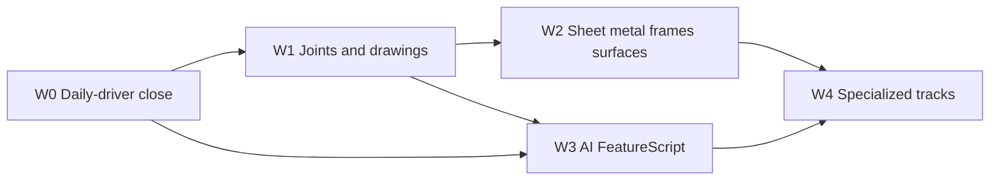

# SolidExpress Feature Roadmap

What to add next, in what order, and **whose tool we copy**.

This is the product sequence. The [implementation plan](implementation-plan.md) is the architecture and phase machinery. [STATUS.md](STATUS.md) is what has already landed. [Tool approaches](../survey/tool-approaches.md) are the binding picks (A1–A20) this roadmap implements.

**How each row lands** (chrome budget, L1–L5 checklist, film id, parallel slices): [landing-protocol.md](landing-protocol.md). Doc index: [README.md](README.md). Do not keep later-wave intent only in chat — park it here or in the landing protocol.

When a pick conflicts with the plan's "majority of the seven" default, the pick wins on *how the tool works*. Architecture, licensing, and the card/`SolverBackend` seams do not move.

---

## 1. Where we are (August 2026)

SolidExpress is already a usable **offline parametric modeler**: OCCT solids, PlaneGCS sketches, a feature graph, semantic cards, and a Godot viewport that prefers geometry-attached handles over dock-only commands.

### Shipped (daily-driver core)

| Area | What exists | Honest limit |
|---|---|---|
| Place / direct | Palette drop, ghost, stack-on-face, planar push/pull, body drag + axis lock, magnets | Push/pull is not a timeline feature; no delete/replace face; no TriBall |
| Sketch | Lines/arcs/circles + visual tools (rect, slot, ellipse, polygon, spline approx), 11 constraints, H/V/coincident inference, trim/extend/offset/fillet, pattern/mirror, Smart Dim, blocks, picture, construction, drag-to-edit | No concentric/symmetric/midpoint/fix; whole-sketch DOF only; no 3D sketch; no auto-dimension; no relax |
| Features | Extrude/revolve (blind, cut/fuse), sweep/loft/path, helix, hole (simple/C-bore/C-sink), fillet/chamfer (constant), shell, draft, offset, mirror, linear/circular pattern, thread, import STEP/STL | No through-all / to-face / next; no variable/C2 fillet; no rib/thicken/wrap; no curve/table patterns; holes are not sketch-point / standards-placed |
| Timeline | Graph, rollback, suppress, reorder, rename, property panel, expressions, configurations | Naming is signature match, not a history name graph |
| Assembly | Multi-doc insert, instances, Fixed/Float, plane coincident / parallel, concentric; sequential placer | **Face-pair mates, not mate connectors.** No revolute/slider/ball. No snap-on-drop. No explode. No interference |
| Drawings | HLR three-view SVG export | No sheet UI, no associative dims, no BOM, no DXF |
| Interop | STEP / IGES / STL | No healing report, no DXF/DWG, no 3MF/glTF, no associative native import |
| AI / voice | Cards, AI-context export, hold-V intent bridge | Unmatched phrases log only; no "what's wrong" on regen; no FeatureScript surface |
| Chrome | ViewCube, nav presets, marking-adjacent RMB + selection strip, icons, F1 overlay | No S-key toolbox, no overlapping-pick popup, no full marking menu |

### The strategic gap

The kernel can build a bracket. A SolidWorks- or Fusion-trained user still hits missing **end conditions, joints, drawings, and a connector-based assembly model** in the first afternoon. Those four, plus recording direct edits in history, are the critical path. Sheet metal, surfacing, CAM, and FEA are real, but they are not what makes SX a daily driver.

---

## 2. Principles for every wave

1. **Copy the best tool, not the biggest suite.** Picks live in [tool-approaches.md](../survey/tool-approaches.md).
2. **Geometry-attached first.** If a verb cannot be reached from the selection, it is unfinished ([interaction-patterns.md](../survey/interaction-patterns.md)).
3. **Recorded hybrid.** Direct edits become history features (A6). No "history off" document mode.
4. **Cards and UUIDs on every new selectable.** Standing rule from the implementation plan.
5. **Happy-path test with the task.** Kernel assertion and/or headless Godot script before merge.
6. **SW-familiar names, modern guts** (A20). The command is called Extrude and Mate; the implementation is Fusion-timeline + Onshape connectors.

---

## 3. Waves

Waves are product increments a user can feel. They map onto implementation-plan phases but are allowed to cut across P4–P7 because those tracks are independent after the feature graph.

---

### Wave 0 — Daily-driver close

**Goal:** a Fusion/SW user can model a real machined part in one sitting without workarounds. No new product category — finish the tools we already advertise.

| # | Feature | Pick | Why this approach | Gate |
|---|---|---|---|---|
| 0.1 | **Mate connectors + DOF joints v0** | A8 Onshape | Current face-pair mates will not scale and fight the plan. Introduce implicit connectors (face center, edge mid, vertex, cylinder axis) and compile existing coincident/concentric/parallel onto them. Add **fastened** (all 6 DOF) as the default drop mate. | Bolt fastened onto a hole in one mate; old `.sxp` mates still load |
| 0.2 | **Extrude end conditions** | SW/Fusion majority | Blind + symmetric is not enough for plates. Add through-all, to-face, to-next, from-to. Offset from face. | Plate cut-through-all volume matches analytic; naming survives |
| 0.3 | **Direct edits as history** | A6 Creo FMX | Push/pull, move-face, delete-face, offset-face write `DirectEdit` features. Imported STEP becomes editable without a fake sketch. | Pull top of imported box +10 mm; regen after sketch-unrelated edit keeps volume |
| 0.4 | **TriBall-class gizmo** | A2 IronCAD | One viewport tool: translate, rotate about inferred axis, copy-rotate, numeric Δ. Replaces the split stretch/lift/axis-lock grips as the *primary* handle. | Scripted rotate-copy of a hole about a cylinder axis → 6 instances |
| 0.5 | **Sketch constraint completeness** | A3 + A4 | Add concentric, symmetric, midpoint, fix, collinear, equal-radius already implied. Per-entity DOF color (blue under / black full / red conflict). Constraint browser lists the conflicting set. | Fully constrained mounting-plate sketch reports DOF 0 per entity |
| 0.6 | **Weak dims + Relax** | A3 Creo + Inventor | New geometry arrives with weak (gray) dims so the sketch always solves. Drag or add a strong dim in Relax: conflicts highlight and drop. | Drag a fully-dimensioned corner; weak dim yields; strong dims hold |
| 0.7 | **Hole on sketch points + standards** | SW Hole Wizard *placement*, tables we already have | Place holes from a sketch point pattern; ISO/UNC sizes from `thread_standards`. Cosmetic vs modeled thread is a checkbox, not a new feature type. | 4× M6 through on a rectangular pattern; mass matches density × volume |
| 0.8 | **Fillet tool feel** | A7 Plasticity | Live radius preview, tangent-chain select, constant + variable + full-round. OCCT failure → non-fatal timeline badge, not a crash. | Variable r1/r2 on a box edge measures at ends; chain fillets a rectangular pocket |
| 0.9 | **Marking menu + pick disambiguation** | A15 Fusion + Onshape S | Hold-RMB / `S` radial menu of selection-aware verbs. Overlapping faces/edges get a cycle popup. | Headless: two stacked faces at a ray → popup lists both UUIDs |
| 0.10 | **DXF into sketch + 3MF/glTF out** | A17 | Own DXF reader/writer (no libdxfrw). Mesh export via Godot/OCCT with deflection control. | DXF rectangle imports as four lines; 3MF of a box is watertight |
| 0.11 | **Import heal + report card** | A6 / A17 | Sew, small-face removal, validity report as a card on the Import feature. | Gappy IGES fixture becomes a solid or a named failure list |
| 0.12 | **Interference check** | Fusion/SW static clash | Select two bodies/instances → overlap volume and a highlight. Required before we claim assemblies. | 1 mm known overlap reports volume within tolerance |

**Wave 0 exit:** the existing 12-part workflow suite (`run_workflow_tests`) plus a new "imported dumb bracket → direct-edit + holes + fasteners + drawing SVG" path, all green. A SW-trained user does not need a workaround for through-all, a hole pattern, or a fastened bolt.

Films, chrome, and slices: [landing-protocol.md](landing-protocol.md#wave-0--daily-driver-close-execute-first) (`fasten_bolt`, `extrude_through_all`, `direct_edit_import`, `triball_hole_circle`, `sketch_mounting_plate`, `hole_wizard_m6`, `fillet_chain_pocket`, `marking_menu_pick`, `dxf_trace_extrude`, `heal_and_clash`).

---

### Wave 1 — Joints that move, drawings that dimension

**Goal:** assemblies behave like mechanisms; drawings are a place you work, not an export.

| # | Feature | Pick | Why this approach | Gate |
|---|---|---|---|---|
| 1.1 | **Joint set** | A8 | Revolute, slider, cylindrical, planar, ball, pin-slot. Limits as joint parameters. Drag the free DOF in the viewport. | Crank-slider samples match analytic positions |
| 1.2 | **Snap-to-mate on drop** | A8 + IronCAD SmartAssembly | Drag a part; hover a connector; magnetic preview; release creates the joint. | Scripted bolt drop onto hole connector → fastened |
| 1.3 | **Exploded views** | SW/Fusion storyboard | Named explode state, tweak along connector Z, consume later in drawings. | Explode round-trips in `.sxp` |
| 1.4 | **Assembly patterns + mirror** | SW | Pattern of a jointed instance follows the seed joint. | 8 bolts on a bolt circle |
| 1.5 | **In-context v1** | A9 Onshape contexts | Sketch on a neighbor face stores a named context; neighbor edits do not flow until Update Context. | Consumer volume unchanged until explicit update |
| 1.6 | **Drawing sheet UI** | A13 SW | Sheets, scale, title-block fields, standard/projected/iso views, full/offset section, detail. Views live in the document, not only SVG. | Section through a hole shows a hatched region; model edit moves the view |
| 1.7 | **Associative dimensions + annotations** | A13 | Linear, angular, radial/diameter, ordinate; notes, leaders, center marks. Anchored by naming UUIDs. | Edit extrude depth → dimension value updates |
| 1.8 | **BOM + balloons** | SW | Instance quantities, item numbers, auto-balloon on an iso view. | 3-part assembly BOM counts match |
| 1.9 | **DXF + PDF drawing export** | A13 / A17 | Vector PDF; own DXF. | Golden bracket sheet entity counts |
| 1.10 | **Projected / intersection sketch geometry** | SW Convert Entities, associative | Use A14 naming so projections survive upstream edits. | Resize the source face → projected edge updates |
| 1.11 | **3D sketch v1** | SW 3D sketch, scoped | Lines, splines, points on faces/axes — enough for sweep paths and frame skeletons. Path feature remains for multi-2D joins. | Sweep a circle along a 3D polyline through 3 non-planar points |
| 1.12 | **Rib + thicken + wrap text** | SW | Open-profile rib; thicken a surface; wrap on cylinder. | Rib attaches to two faces; volume > 0 |

**Wave 1 exit:** scripted gearbox (12 components, 4 joint types, pattern, explode) + a 2-sheet dimensioned drawing with BOM that survives a parameter edit.

Films, chrome, and slices: [landing-protocol.md](landing-protocol.md#wave-1--joints-that-move-drawings-that-dimension) (`crank_slider`, `snap_bolt_drop`, `explode_gearbox`, `bolt_circle_pattern`, `context_update`, `drawing_section`, `drawing_follows_model`, `drawing_bom`, `convert_survives_edit`, `sweep_3d_polyline`, `rib_and_wrap`).

---

### Wave 2 — Sheet metal, frames, surfaces

**Goal:** the three specialized part environments that mid-range MCAD users expect in the box (A10, and plan P8).

| # | Feature | Pick | Why this approach | Gate |
|---|---|---|---|---|
| 2.1 | **Sheet metal core** | A10 + SW flange set | Base/edge/miter flange, hem, jog, bend relief, K-factor / bend table per material. | Flanged box flat length matches bend-allowance formula |
| 2.2 | **Simultaneous folded / flat** | A10 Onshape | Folded body, flat pattern, and bend table visible together; either side edits the other. | Edit a flat-side dimension → folded flange updates |
| 2.3 | **Convert solid → sheet metal** | SW / Creo FMX | Recognize thin solids and imported sheet bodies. | Thin box unfolds |
| 2.4 | **Flat DXF + drawing view** | A10 + A13 | Bend lines and direction callouts. | Flat view layer count golden |
| 2.5 | **Frames / structural members** | SW weldments | 3D-sketch path + ISO/ANSI profile library, miter/butt, cut list. | Rectangular frame: 4 members, correct cut lengths |
| 2.6 | **Cosmetic welds + symbols** | SW | Bead along an edge; symbol on the drawing. | Symbol appears on the sheet |
| 2.7 | **Surface toolset v1** | Plasticity feel, SW coverage | Extrude/revolve/sweep/loft as surface; trim, extend, offset, knit, thicken, fill/patch. | Knit 6 planes → solid box |
| 2.8 | **Continuity analysis** | Onshape 2026 / SW zebra | Zebra + curvature map in the viewport. | Zebra shader on a cylinder; G1 check across a knit |
| 2.9 | **Replace face** | A6 | Patch a solid with a surface; recorded. | Replaced top face, solid still valid |

**Wave 2 exit:** sheet-metal enclosure + frame skeleton + flat-pattern drawing sheet, golden volumes and cut list.

**Explicitly not in this wave:** aerospace joggles, Class-A, SubD (spike in Wave 4), composites, mold wizard.

Films, chrome, and slices: [landing-protocol.md](landing-protocol.md#wave-2--sheet-metal-frames-surfaces) (`flange_box_flat`, `flat_edits_folded`, `convert_thin_box`, `flat_on_drawing`, `frame_cutlist`, `weld_on_sheet`, `knit_to_box`, `zebra_cylinder`, `replace_face`).

---

### Wave 3 — AI-first surface and user features

**Goal:** the differentiator the architecture was built for. Language and cards become a way to *build*, not just annotate.

| # | Feature | Pick | Why this approach | Gate |
|---|---|---|---|---|
| 3.1 | **Selection query language** | Plan 10.2 | `type=`, `created-by=`, `adjacent-to=`, geometric predicates → UUID sets. Voice and FeatureScript both compile here. | "cylindrical faces of feature X" returns hole walls |
| 3.2 | **Card digests** | A16 | Auto natural-language line on every card from adjacency + feature params. | Golden model cards mention feature + placement |
| 3.3 | **FeatureScript-shaped user features** | A11 | A small language (or JSON+expressions first) whose compiled form *is* a graph feature. Ship 2–3 native features rewritten in it to prove the loop. | User feature "countersunk hole on face" instantiates and regenerates |
| 3.4 | **Intent → constraints** | A16 / plan 10.4 | "Make these flush" + two card UUIDs → connector/joint or sketch constraints. PlaneGCS stays the numeric core. | Two faces become fastened with offset 0 |
| 3.5 | **What's Wrong** | SW AURA | Failed regen names the feature, the missing ref, and A14 repair candidates. | Break a fillet edge on purpose → UI offers the rematch |
| 3.6 | **Auto-dimension / fully define** | SW + NX propose | One click promotes weak dims / inferred relations until DOF 0 or a listed remainder. | Mounting-plate sketch reaches DOF 0 |
| 3.7 | **iLogic-style rules** | A12 | `if width > 100 then suppress rib`. Design-table CSV import. | Table builds 3 config volumes |
| 3.8 | **Headless JSON-RPC / CLI** | Plan 10.1 | Open, edit, export without Godot window. CI uses this. | CLI builds the Wave 0 bracket to STEP |
| 3.9 | **NX-style propose-on-select** | A3 | Selecting sketch entities shows inferred relations to promote, without requiring them up front. | Select two near-parallel lines → "parallel?" chip |

**Wave 3 exit:** mocked-LLM demo — "four M6 clearance holes near the corners of the top face, symmetric" — produces the constrained hole pattern via queries + intents + user features.

Films, chrome, and slices: [landing-protocol.md](landing-protocol.md#wave-3--ai-first-surface-and-user-features) (`query_hole_walls`, `card_digest`, `user_csink`, `intent_flush`, `whats_wrong_fillet`, `auto_define_plate`, `rules_three_configs`, `cli_bracket_step`, `propose_parallel`, `nl_four_holes`).

---

### Wave 4 — Specialized tracks (backlog, capacity-driven)

Ordered. Each item is a spike-then-product; do not start until its dependency wave is green.

| # | Track | Pick | Dependency | Note |
|---|---|---|---|---|
| 4.1 | Configurations v2 / table editor | A12 | 3.7 | Config-aware BOM and drawings |
| 4.2 | Advanced fillets (setback, C2) | A7 | 0.8 | OCCT limits are the risk; Fable-led |
| 4.3 | 2.5-axis CAM | A18 Fusion | W1 drawings | opencamlib (LGPL) + our post format; open posts as a value |
| 4.4 | Linear static FEA | Fusion-class wizard | W0 materials | MFEM (BSD) or vetted alternative; CalculiX/Gmsh banned |
| 4.5 | SubD → B-rep | Fusion Form scope, OpenSubdiv | W2 surfaces | Spike first; not a second app |
| 4.6 | PDM-lite | A19 Onshape semantics on files | 3.8 | Versions/branches on `.sxp` + card-aware diff |
| 4.7 | Routing (tube/pipe) | Creo PCX *scope*, SW UI | 1.11 3D sketch | Bend tables; no spec-driven plant until asked |
| 4.8 | Mold basics | SW | W2 | Parting line, core/cavity split — not Mold Wizard |
| 4.9 | Scan / mesh hybrid | NX Convergent *ambition*, Fusion Mesh now | 0.11 | Measure/snap/boolean vs mesh; full convergent is a later spike |
| 4.10 | Mechanical joints (gear, screw, cam) | SW advanced mates | 1.1 | After basic DOF joints feel good |
| 4.11 | MBD / PMI | A13 first, Creo later | 1.7 | 3D dims on faces + AP242 only after 2D dims are trusted |
| 4.12 | Standard-parts catalog | A1, SW Toolbox *in base* | 0.1, 1.2 | ISO fasteners that snap to hole connectors |
| 4.13 | ECAD board-in-enclosure | A18 Fusion | W1 | IDX/IDF first, not a schematic editor |

Films and chrome for 4.1–4.13: [landing-protocol.md](landing-protocol.md#wave-4--specialized-tracks). Deferred-unscheduled items (Class-A, composites, plant, MBSE, cloud-only, …) are parked in that same section — add a row there instead of leaving the idea in chat.

---

### Wave 5 — Print-first

Picks: [print-first.md](../survey/print-first.md) (P1–P6). Form rail is print prep; 3MF out; no slicer.

| # | Feature | Pick | Gate |
|---|---|---|---|
| 5.1 | Wall thickness + digest | P1 | 20 mm cube `min_wall≈20`; 1.2 mm plate fails a 2 mm threshold |
| 5.2 | Overhang + orient | P2, P3 | L-shelf overhang > 0; 10×10×80 orients to height ≈ 10 |
| 5.3 | 3MF metadata + `print.json` | P4, P5 | 3MF contains `sx:bed`; `.sxp` round-trips the setup |

Films: `print_thin_wall`, `print_overhang_orient`. Later: lattices, supports, trays (print-first §5).

---

## 4. Mapping to the implementation plan

| Roadmap | Plan phases | Notes |
|---|---|---|
| Wave 0 | Finish P3 leftovers, P4.3–4.9, P5.2–5.3 v0, P7.5–7.6, P1 gizmo | Mate connectors (0.1) are the one *migration* — do them before adding more face-pair mate types |
| Wave 1 | P5 rest, P6, P4.4, 3D sketch from P8.3 curves | Drawings become a document, not an exporter |
| Wave 2 | P8 | Onshape simultaneous flat is the UX delta vs. the plan's SW-shaped list |
| Wave 3 | P10 | FeatureScript (A11) is called out as a language, not only a JSON-RPC API |
| Wave 4 | P9, P11 | Same backlog, reordered by pick quality and dependency |

Phase 11 items that stay deferred until a user asks: Class-A, progressive die, composites, shipbuilding, factory layout, MBSE, cloud rendering farms.

---

## 5. Migration note — assemblies

STATUS already shipped Fixed / plane-coincident / plane-parallel / concentric as **face-pair mates** with a sequential placer. That is the SolidWorks 1990s model.

Wave 0.1 replaces the *data model* with mate connectors. Compatibility:

- Load: each old mate becomes two implicit connectors + one DOF joint.
- UI: AssemblyPanel grows a connector list; the two-click face flow still works and *creates* connectors.
- Do not add gear/cam/width mates onto the old struct — they land on connectors in Wave 4.10.

This is the one place the shipped code and the original plan already disagreed. The roadmap settles it: **connectors win**.

---

## 6. What "done" looks like for a v1 product

A v1 SolidExpress that can stand next to Fusion/Onshape *for mechanical parts* (not for CAM/ECAD/enterprise PLM):

- Wave 0 + Wave 1 complete
- Wave 2 sheet-metal core (2.1–2.4) — frames can slip if needed
- Wave 3.1–3.5 (queries, cards, user features, intent, What's Wrong)
- Offline `.sxp`, STEP in/out, DXF drawings, Linux/Windows desktop

That is a **daily driver for brackets, enclosures, and small mechanisms**, with an AI/voice path no incumbent has. It is not a CATIA or NX replacement, and it should not try to be.

---

## Related

- [README.md](README.md) — plan index (park later ideas here, not in chat)
- [landing-protocol.md](landing-protocol.md) — chrome, films, slices for every wave
- [tool-approaches.md](../survey/tool-approaches.md) — picks A1–A20
- [master-feature-list.md](../survey/master-feature-list.md) — full catalog
- [feature-matrix.md](../survey/feature-matrix.md) — who has what
- [implementation-plan.md](implementation-plan.md) — how we build
- [STATUS.md](STATUS.md) — what has landed
- [education-research.md](../education-research.md) — how the command names should be taught
